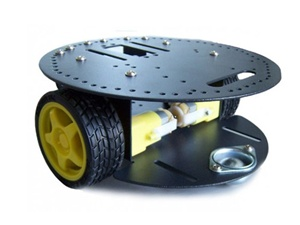
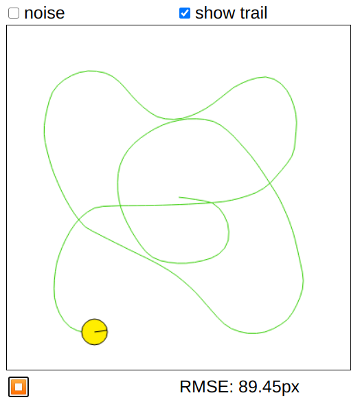
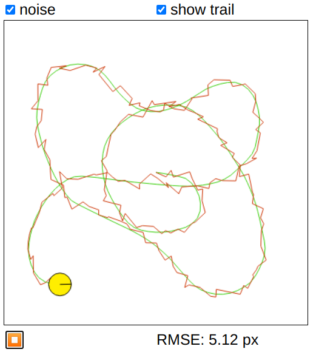
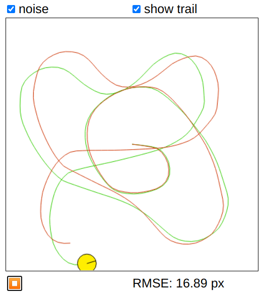
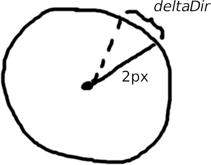

# Assignment 1: Kalman Filter
## Introduction
The Kalman filter allows us to combine a variety of potentially erroneous/inaccurate sources (such as extrapolation via Euler integration, readings from motion/distance sensors, GPS signals, ...) and obtain an estimate about the state of our robot (such as its position) that is more accurate than any individual source.

In this assignment we want to estimate as best as we can the position/location of a (non-balancing) two-wheeled robot such as the one depicted below:



Our robot has 2 sources of positional data:

1. It can precisely keep track of the exact rotation of each of its wheels (from which we can calculate its orientation and speed at any point in time, and thus its position).
2. It is equipped with a GPS sensor.

In an ideal world, either of these sources would be sufficient to pin-point our robot's location. In practice the wheels are subject to slip which may cause the robot to believe it's turned a different amount than it actually has; this error accumulates over time (aka "drift"). While GPS does not suffer from drift, it is simply not accurate enough (its resolution isn't high enough) on its own for the tasks we want our robot to do. Thus we must complement it with extra information.

## Simulator
Head over to our [interactive robot simulator](https://denniskb.github.io/hy475). Depicted is a yellow robot in the top-down view. The black radial line shows its orientation. Press &#x25B6;. Once started the robot drives at a constant speed of 60 px/s (or 2 px/timestep, there is no (de-) acceleration) following a pre-recorded sequence of (relative) steering inputs (given in radians) for 30 s, or until stopped via &#x23F9;. The green path depicts where the robot has actually been:



It is your job to estimate its position via the Kalman filter, which we will derive together step by step. For this purpose you ought to implement the function `predict()` inside the editor on the right-hand side of the webpage (changes are saved via cookies) in JavaScript. You can use any JavaScript code in your implementation. If you need to persist variables between function invocations, use `this`:

```javascript
// First time we are called?
if (typeof this.counter === 'undefined') {
    // Initialize persistent variable(s)
    this.counter = 0;
}
...
// Use persistent variable(s)
this.counter++;
```

You can also use any of the [math.js](https://mathjs.org/docs/index.html) library which is pre-loaded for you. `predict()` is invoked on every simulation step and is passed the (requested) relative change in direction in radians *`deltaDir`* (aka steering/control input) and the current GPS location *`gpsPos`*, a 2-element array (equivalent to a 2D vector). Given these data we have to *predict* the robots next location and return it as a 2D vector `[x, y]`. Let us approach this task incrementally with ever-increasing difficulty and fidelity to familiarize ourselves with the coding environment.

Finally, you can debug your code using the "Developer Tools" built into every modern browser. Use `console.log()` for debug prints.

## Na&#x00EF;ve Approaches
By far the simplest thing we can do is simply return the GPS signal as our position. Try to do so right now and compare with the provided solution :

<details>
<summary>Expand to reveal solution</summary>

```javascript
return gpsPos;
```
</details>

If you run this code you'll notice that the actual and predicted paths overlap perfectly (the reason our "RMSE" isn't quite 0 is that we're returning the current position when in fact we should be returning the *next* position&mdash;don't worry about this now). This is because so far we've been simulating an ideal world without any noise. Reset the simulation, check the "noise" box, and run it again. You should now see something like this:



The tracking is prety poor as the GPS has an error standard deviation (STD) of **5 px**.

Next let us estimate the robot's location purley from the control inputs. We know that the robot starts at *position* **`[200, 200]`** (px) and faces in *direction* **0** (rad). It moves at a constant *speed* of **2 px/step**. Given this starting configuration and a series of turn inputs *`deltaDir`* compute the robot's location using simple Euler integration. If you did it correctly, the actual and predicted path should overlap exactly (don't forget to uncheck "noise" again before trying out your solution). Compare with the provided solution:

<details>
<summary>Expand to reveal solution</summary>

```javascript
if (typeof this.x === 'undefined') {
    this.x = 200;
    this.y = 200;
    this.dir = 0;
}

this.x += 2 * math.cos(this.dir);
this.y -= 2 * math.sin(this.dir);
this.dir += deltaDir;

return [this.x, this.y];
```

The minus in `-=` is needed because in our case the y-axis points down while in mathematics it points up.
</details>

Once again, turn "noise" back on and re-run the simulation, you should observe something like the following:



We observe that, at least in the beginning, our prediction follows the actual path much closer than when relying purely on the GPS signal. However, over time it grows very in-accurate due to drift from tyre slip. To be precise, each time the robot is requested to turn, it may slip, more so the sharper the turn. Each turn input is realized/executed with a error STD of **0.1 \* |*deltaDir*|** (rad). Next we want to combine these two estimation methods using the Kalman filter to obtain a new estimate that is more accurate than any individual one.

## Kalman Filter (/w equations)
The Kalman filter consists of 3 main components:

1. The *estimate* (the Euler-integrated position in our case)
2. The *observation* (the GPS signal in our case)
3. The "Kalman gain" *K* which controls how much to rely on the *observation* vs. the *estimate*.

In order to calculat the Kalman gain both the *estimate* and *observation* need to be associated with an error (aka certainty). In some cases these errors can simply be looked up in a sensor manual, in others they must be calculated/estimated. Copy-paste the following template into the simulator and complete the **...**

```javascript
if (typeof this.x === 'undefined') {
    this.x = 200;
    this.y = 200;
    this.dir = 0;
    this.errEst = ...;
}

// Compute estimate and its associated error
var xEst = ...;
var yEst = ...;
this.dir += deltaDir;
this.errEst += ...;

// Compute observation and its associated error
var xObs = ...;
var yObs = ...;
var errObs = ...;

// Compute Kalman gain
var K = ...;

// Compute new robot position
this.x = ...;
this.y = ...;

return [this.x, this.y];
```

### Tips

- You already successfully computed both the *estimate* and *observation* individually, now we just have to combine the two. You can re-use all the code previously written.
- The only really new parts are the errors. They've been mentioned previously in **bold** text. Note that the *estimate* error accumulates over time while the *observation* error is constant, why is that? Also note that the *estimate* error is provided in radians, while the *observation* error is provided in pixels. You'll have to convert the former into the latter or otherwise your calculations won't make any sense. You can easily ascribe a pixel amount to the turn error by using simple trigonometry and the fact that the robot travels at constant speed.
- *K* is a simple weight, the higher it is the more we rely on the *observation* and vice versa. The new robot position is then a simple linear interpolation between *estimate* and *observation* using *K*.

If done correctly, you should observe something like the following when running the simulation (with "noise" on):


<details>
<summary>Expand to reveal solution</summary>

```javascript
if (typeof this.x === 'undefined') {
    this.x = 200;
    this.y = 200;
    this.dir = 0;
    this.errEst = 0;
}

// Compute estimate and its associated error
var xEst = this.x + 2 * math.cos(this.dir);
var yEst = this.y - 2 * math.sin(this.dir);
this.dir += deltaDir;
this.errEst += math.abs(deltaDir) * 0.2;

// Compute observation and its associated error
var xObs = gpsPos[0];
var yObs = gpsPos[1];
var errObs = 5;

// Compute Kalman gain
var K = this.errEst / (this.errEst + errObs);

// Compute new robot position
this.x = xEst + K*(xObs - xEst);
this.y = yEst + K*(yObs - yEst);

return [this.x, this.y];
```

### *Estimate* Error Calculation



From its current location the robot travels exactly 2 px in any direction within one simulation step. The error STD between the actual and desired direction is `0.1 * |deltaDir|` **radians** (in either direction). In order to (approximately) convert to pixels we calculate `0.1 * |deltaDir| / 2pi * 2px * 2pi = |deltaDir| * 0.2px`.

Play around with the errors and see if you can obtain an even lower RMSE.
</details>

## Kalman Filter (/w matrices)
You've effectively implemented the Kalman filter in the form of hand-written equations. Your homework is to translate this filter into its more popular "matrix form" as depicted on [slide 17](https://www.csd.uoc.gr/~hy475/lectures/2.kalman.ppt). Copy-paste the subsequent template into the code editor and complete the **...**

Submit your solution (source code) to denniskb[at]csd.uoc.gr together with your student ID no. using the subject line "HY475 Assign 1". Ask (and answer) questions via the [issue tracker](https://github.com/denniskb/hy475/issues).

```javascript
if (typeof this.mu === 'undefined') {
    //state = [x, y, dir, w=1]
    this.mu = [200, 200, 0, 1];
    this.S = math.zeros(4, 4);
    this.errEst = 0;
}

// PREDICTION

// State transition matrix (advances dynamics)
var A = [
    [1, 0, 0, ...],
    [0, 1, 0, ...],
    [0, 0, 1, 0],
    [0, 0, 0, 1]
];
var AT = math.transpose(A);

// Control input
var u = [...];
// Control input->state influence matrix
var B = [...];

// Error in (motion) estimate
this.errEst += ...;
// Diagonal matrix with all entries = errEst^2
var R = math.multiply(math.identity(4), this.errEst*this.errEst);

// mu = A*mu + B*u
this.mu = math.add(math.multiply(A, this.mu), math.multiply(B, u));
// S = A*S*AT + R
this.S = math.add(math.multiply(A, this.S, AT), R);

// CORRECTION

// Measurement/observation (gps)
var z = [..., ..., this.mu[2], 1];
// Measurement->state conversion matrix
var C = math.identity(4);
var CT = C;

// Error in observation
var errObs = ...;
// Diagonal matrix with all entries = errObs^2
var Q = math.multiply(math.identity(4), errObs*errObs);

// K = S*CT*(C*S*CT + Q)^-1
var K = math.multiply(
    this.S, CT, math.inv(math.add(math.multiply(C, this.S, CT), Q))
);

// mu = mu + K*(z - C*mu)
this.mu = math.add(
    this.mu,
    math.multiply(
        K,
        math.subtract(
            z,
            math.multiply(C, this.mu)))
);

// S = (I-K*C)*S
this.S = math.multiply(
    math.subtract(math.identity(4), math.multiply(K, C)), this.S
);

this.mu = this.mu._data;
return [this.mu[0], this.mu[1]];
```

<details>
<summary>Template solution</summary>

```javascript
if (typeof this.mu === 'undefined') {
    //state = [x, y, dir, w=1]
    this.mu = [200, 200, 0, 1];
    this.S = math.zeros(4, 4);
    this.errEst = 0;
}

// PREDICTION

// State transition matrix (advances dynamics)
var A = [
    [1, 0, 0,  2*math.cos(this.mu[2])],
    [0, 1, 0, -2*math.sin(this.mu[2])],
    [0, 0, 1, 0],
    [0, 0, 0, 1]
];
var AT = math.transpose(A);

// Control input
var u = [deltaDir];
// Control input->state influence matrix
var B = [[0], [0], [1], [0]];

// Error in (motion) estimate
this.errEst += math.abs(deltaDir) * 0.2;
// Diagonal matrix with all entries = errEst^2
var R = math.multiply(math.identity(4), this.errEst*this.errEst);

// mu = A*mu + B*u
this.mu = math.add(math.multiply(A, this.mu), math.multiply(B, u));
// S = A*S*AT + R
this.S = math.add(math.multiply(A, this.S, AT), R);

// CORRECTION

// Measurement/observation (gps)
var z = [gpsPos[0], gpsPos[1], this.mu[2], 1];
// Measurement->state conversion matrix
var C = math.identity(4);
var CT = C;

// Error in observation
var errObs = 5;
// Diagonal matrix with all entries = errObs^2
var Q = math.multiply(math.identity(4), errObs*errObs);

// K = S*CT*(C*S*CT + Q)^-1
var K = math.multiply(
    this.S, CT, math.inv(math.add(math.multiply(C, this.S, CT), Q))
);

// mu = mu + K*(z - C*mu)
this.mu = math.add(
    this.mu,
    math.multiply(
        K,
        math.subtract(
            z,
            math.multiply(C, this.mu)))
);

// S = (I-K*C)*S
this.S = math.multiply(
    math.subtract(math.identity(4), math.multiply(K, C)), this.S
);

this.mu = this.mu._data;
return [this.mu[0], this.mu[1]];

```
</details>

### Additional Reading
- [In-depth visual explanation of the math behind the Kalman filter](https://www.bzarg.com/p/how-a-kalman-filter-works-in-pictures/)
- [In-depth video tutorial series on the Kalman filter from A-Z](https://www.youtube.com/watch?v=CaCcOwJPytQ&list=PLX2gX-ftPVXU3oUFNATxGXY90AULiqnWT)