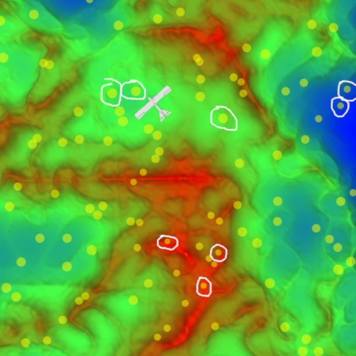

# Assignment 3: Particle Filter
[](https://www.youtube.com/watch?v=WtmwQCXoTM8)

(Click on the image to view the video on youtube.)

In this assignment we want to implement a particle filter to localize an airplane. A particle filter works by creating a bunch of (random) hypotheses (aka particles), tracking their fitness over time, and slowly eliminating unfit particles (ones that do not model the plane's location well). The result is that only the best-fitting particles survive and converge to the plane's true location, as can be seen in the video above.

We will implement the filter in its entirety step by step, coding each phase of the particle filter and sanity-checking it against ground truth data. However, you'll do the heavy lifting writing most of the code. Your homework is to work through this tutorial, your submission will be the code you end up with.

## Introduction


Navigate to our [interactive plane simulator](https://denniskb.github.io/assign3/) which is pre-filled with the following template:

```javascript
// CONSTANTS
var N = 100;        // no. of particles
// var NOISE = ...; // process noise

// INITIALIZATION
if (typeof this.particles === 'undefined') {
  this.particles = [];
	
  // TODO 1: Initialize N random particles [x, y, w].
}

// UPDATE
/*----------------------------------------
this.particles.forEach(function(p) {
  // TODO 2: Update particle p's location.
	
  // Wrap particles around screen
  for (var i = 0; i < 2; i++) {
    if (p[i] < 0) p[i] += 500;
    if (p[i] >= 500) p[i] -= 500;
  }
});
----------------------------------------*/

// WEIGHT CALCULATION & NORMALIZATION
/*----------------------------------------
var total = 0;
this.particles.forEach(function(p) {
  // TODO 3.1: Calculate new weight 'w' for particle 'p'.

  p[2] = w;
  total += w;
});

// TODO 3.2: Normalize each particle's weight so they sum to 1.
----------------------------------------*/

// RESAMPLING
/*----------------------------------------
// TODO 4.1: Calculate prefix sum of particle weights in 'buckets':
var buckets = [];
...
this.particles.forEach(function(p) {
  ...
  ...
});

var newParticles = [];
var r = math.random();
for (var i = 0; i < N; i++) {
  // TODO 4.2: Select particle and copy it into 'newParticles':
  var particleID = ...;
  var particle = ...;
  newParticles.push(...);

  r += 1/N;
  if (r >= 1) r -= 1;
}
this.particles = newParticles;
----------------------------------------*/

return this.particles;
```

All you should see is a white Cessna flying over empty terrain when you press the "play" button. After all we merely create an empty array `this.particles` and return it.

The plane does not have a GPS. It is only equipped with 3 instruments/data with regards to localization:

- A detailed map of the terrain with height data. It is communicated to you via the `terrain` parameter. In order to access the height of the terrain at pixel (x, y) use `terrain.at(x, y)`.
- A barometer (altimeter) which reports the plane's altitude above sea level, passed in the `atlSea` parameter.
- A radar altimeter which reports the plane's altitude above ground, passed in the `altGround` parameter.
- Finally `dx` and `dy` represent how many pixels the plane moved in the x and y direction since the last time your particle filter was invoked. (This is calculated by taking the plane's airspeed and extrapolating it in the direction its compass is pointing in. The calculation has already been done for you.)

## Step 1: Initialization


We need to begin somewhere. Since, at the beginning, we don't know anything about our plane's location, we simply initialize our particles randomly. This spreads them out evenly and avoids any bias/skew from regular initialization.

Navigate to "TODO 1" and fill the `this.particles` array/vector with `N=100` random particles. Each particle itself is a 3-component array/vector `[x, y, w]` where `x` and `y` represent the particle's location in pixels and `w` represents the particle's weight. Our terrain is 500x500 pixels wide, so valid coordinates must be between 0 <= x,y <= 499. In order to generate suitable random numbers, the [`math.random(min, max)`](https://mathjs.org/docs/reference/functions/random.html) function should prove helpful. In order to add elements to an array/vector, use the [`Array.push()`](https://www.w3schools.com/jsref/jsref_push.asp) method as in `this.particles.push(...)`. The weight `w` should simply be set to `1/N` for now. In general, we always want our weights to sum to 1 (setting them to `1/N` in the beginning accomplishes this).

If done correctly, you should see something similar to the image above: The plane flying around a sea of randomly placed, *static* (we aren't updating them yet) particles. If you don't, check the console for potential errors.

## Step 2: Update
[](https://www.youtube.com/watch?v=RjPapqWTSkg)

Next comes the update step in which we need to move the particles in unison with the plane. Bear with me for now and just follow the instructions, once we get to step 3 (weight calc.) it will all start making sense and coming together ;)

Navigate to section "UPDATE" and uncomment it. Next navigate to "TODO 2" and update the particles' locations. Remember that a particle `p`'s location (x,y) is stored in its first 2 components `p[0]` and `p[1]`. Also remember that the planes movement (delta) is stored in `dx` and `dy`. If done correctly you should observe something similar to the video above (click on the image to play the video): A sea of particles moving together with the plane, as if they were attached ot it.

Next we need to add random noise to our particles' motions. This is crucial for the particle filter to work properly. Why will become apparent once we implement step 4 (resampling). Uncomment the constant `NOISE` and set it to a sensible value. The plane is moving at a constant speed of 50 px/s. Our particle filter is invoked 10x per second, meaning the plane moves ~5 px between invocations. The noise's purpose is to *diversify* our particles helping them avoid getting stuck in local maxima. It shouldn't be so large as to completely dominate their motion (they should still overall follow the plane), it should just make them 'wiggle' on their paths, as can be seen in the below video:

[](https://www.youtube.com/watch?v=yA2Oy2RilQA)

Once again, the  [`math.random(min, max)`](https://mathjs.org/docs/reference/functions/random.html) function will come in handy. Note that `min` can be negative ;)

## Step 3: Weight Calculation
Next we want to calculate our particles' weight or fitness. It is a number which expresses how well the particle models the plane's location. A high value means "very much" while a low value means "not at all". Don't worry about the exact numerical value, the weights will be normalized later anyway. What's important is their relative value to one another.

The only thing we can base our weights on is the altitude above ground. For the plane it is given in `altGround`. For the particles it can be calculated using `altSea` and `terrain.at(x, y)`. The closer the plane's and a particle's altitude above ground, the higher its weight should be. You can use any error metric you like, but don't choose a too aggressive one (such as MSE for example) or it may lead to particle *starvation* lateron (particles getting filtered too early because of their low weight). A simple linear error metric (such as absolute difference for example) will do fine. You also need to know that the lowest point of the terrain is 0 m (blue sea), while the highest point of the terrain is 255 m (red mountains).

Navigate to section "WEIGHT CALCULATION & NORMALIZATION" and uncomment it. Navigate to "TODO 3.1" and calculate a suitable weight for each particle, store it in the variable `w`. Remember that variables in JavaScript need to be *declared* with `var` as in `var w = ...`. Feel free to use multiple lines and additional helper variables that hold intermediate results in order to produce clean code. Navigate to "TODO 3.2" and *normalize* all particles' weights so they sum to 1. The `total` weight which we calculated in 3.1 should come in handy for this.

[](https://www.youtube.com/watch?v=UbFmKqj1lps)

If done correctly you should see something similar to the above: Particles now have different sizes based on their weights (the weight contorls their diameter (as opposed to their area) in order to exaggerate the effect). Look at the particles in white circles. The plane is flying over medium-height, green terrain. So naturally all particles placed over green terrain will have a similar altitude above ground and should therefore have a high weight. Particles with a very different altitude above ground on the other hand (such as the ones above sea or mountains) have a lower weight and are thus smaller. However, they're still visible, they didn't become single-pixel dots--that's what I meant by "non-aggressive error metric". Use the "pause" button in the simulator to halt the simulation and inspect your particles' sizes. Click on the image above to play the video and see the particles change their size as they move over (dis-)similar terrain. Compare with your simulation.

You might ask yourself "so far so good, how does that help us localizing the plane?". As you see in the image above, many particles have a high weight--how do we know which one's the plane location? While it is true that in any given *instant*, *most* particles model the plane well, only very *few* particles will model it well *consistently* over time. This observation is at the heart of the particle filter. Say half our particles have a high weight. Now the plane moves from medium to low terrain. Only very few particles will make the same transition. And only one particle (the one at the plane's location) will *consistently* make the same transitions as the plane. The process of selecting these "consistently good" particles is called...

## Step 4: Resampling
Resampling is the process of filtering out "bad" particles over time. Now we could simply *sort* the particles by their weight and pick the, say, top 90%. After enough iterations we would only be left with one particle. That's called "selection"/"filtering" and it's not what we want to do. We want to "sample" instead. The problem with a hard cut-off (as in the sorting example) is that even "good" particles sometimes have low weights. Imagine the best particle, just a few px away from the plane's true location: if it dared to fall into the bottom 10% just *once* out of *hundreds* of iterations, it would be eliminated forever (and we would loose our ability to predict the plane's location). Therefore it is important that even "bad" particles have a *chance* of getting selected.

This is achieved by "sampling": We randomly select particles to keep, *biased by their weights*. Generating (uniformly distributed) random numbers with `math.random()` is a form of sampling: Every number has the same (uniform) chance of getting picked. We don't want to pick our particles uniformly though, but biased by their weights: a particle with weight 0.3 should have be picked 3x more likely/often than a particle with a weight of 0.1 (but the lower-weight particle can still be picked (and the higher-weight particle can still be eliminated, albeit unlikely)). Furthermore, sampling keeps the no. of particles constant (some are eliminated while others are duplicated/replicated). This keeps the computational cost of the particle filter constant and increases our chance of converging on the plane's location (by keeping more particles "in play").

By now, adding random noise to the particles' motions should make sense: If one particle got replicated, say, 3x during resampling, we would end up with 3 *identical* particles in the next iteration. What's the point of exploring the same hypothesis 3x other than burning CPU cycles? By adding a small amount of noise we turn these 3 copies into independent hypotheses. Resampling has then the effect of concentrating more particles around the plane's probable location which in turn gets explored more heavily compared to other locations. Also, consider that our terrain is 500x500 px, resulting in 250k possible plane locations. We only generate 100 particles. The possiblity that any of them coincides with the plane's location is slim. Without noise, if we didn't happen to generate a particle right at the nose of the plane (very unlikely) we would never be able to converge to the plane's true location.

There are many resampling algorithms. We want to implement the so-called [low-variance resampler](http://www.cs.cmu.edu/~16831-f14/notes/F14/16831_lecture04_josephba.pdf) (page 5). As any other [sampling from a discrete probability distribution](https://stackoverflow.com/questions/1761626/weighted-random-numbers) it works by creating a set of buckets with varying sizes, drawing uniform random numbers, and determining where these fall into (see figure 1).

```
_____________________________
| x | x |   | x |xx | x | x |
-----------------------------
_____________________________
|x| | xx  |   | x |  | xxx  |
-----------------------------
```

*Figure 1: (top) Uniform sampling: We create equal-sized buckets. We then generate (unfirom) random numbers and observe which bucket they fall into (x). Since all buckets have the same size, each bucket has the same chance of getting picked. As is the nature with random numbers, some buckets get picked multiple times, some don't at all. This is equivalent to simply generating random array indices and returning the corresponding elements. (bottom) The buckets are now scaled proportionally to the particles' weights. Still generating uniform random numbers, bigger buckets now have a higher chance of getting hit. This requires additional coding.*

In contrast to [importance sampling](http://www.cs.cmu.edu/~16831-f14/notes/F14/16831_lecture04_josephba.pdf) (IS) (page 1) which then generates `N` random numbers and selects the particles in the corresponding buckets, low-variance sampling only generates a single random number `r` in the interval `[0, 1)` and then picks `N` particles from buckets `r + i * 1/N` for `i = 0..N-1`, wrapping around the interval.

Onto coding! Navigate to section "RESAMPLING" and uncomment it. First we need to calculate the aformentioned `buckets`, which is nothing more than the [prefix sum](https://en.wikipedia.org/wiki/Prefix_sum) of our particles' weights. Navigate to "TODO 4.1" and implement it. It is very simple to code, you'll only need one additional helper variable to keep track of the running sum. You shouldn't need more than one short statement per "...".

Next comes the actual resampling part. Navigate to "TODO 4.2". The series of random numbers `r` is already generated for you. All you need to do is copy particles from `this.particles` into `newParticles` according to which bucket `r` falls into. An efficient way to determine the correct bucket is [binary search](https://en.wikipedia.org/wiki/Binary_search_algorithm) which is already provided to you via the `Array.lowerBound(x)` method (which returns the *index* of the *smallest element >= x*). Remeber that you normalized the particle weights before, meaning the sum to 1. Please also note that each individual particle is itself an array/vector. In order to *copy* it you have to use the `Array.clone()` method, using `=` would simply create a reference:

```javascript
var arr = [1, 2, 3];

var ref = arr; // ref points to arr, chaning ref
               // changes arr and vice versa
var copy = arr.clone(); // copy and arr are independent
                        // copies of one another
```

If done correctly you should observe the behavior shown in the video at the top of this assignment. Use this opportunity to play around with `N` and `NOISE` and develop an intuition about particle filters. Perhaps even code your own resampling method such as IS and compare its performance...

Submit your base64-encoded code to denniskb(at)csd.uoc.gr by TODO:DATE. Good luck!

## Additional Reading

- [Intuitive, visual explanation of how a particle filter works](https://www.youtube.com/watch?v=aUkBa1zMKv4) (youtube)
- [Short, formal yet easy to follow tutorial on particle filters](http://www.cs.cmu.edu/~16831-f14/notes/F14/16831_lecture04_josephba.pdf) (pdf)
- [Great, in-depth tutorial on particle filters](https://www.mdpi.com/1424-8220/21/2/438/pdf) (pdf)