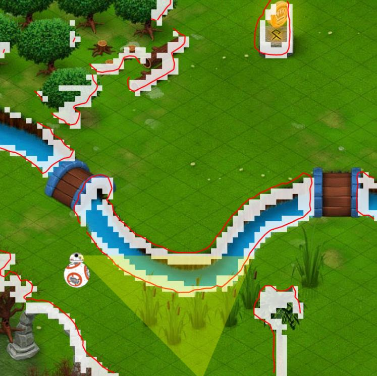
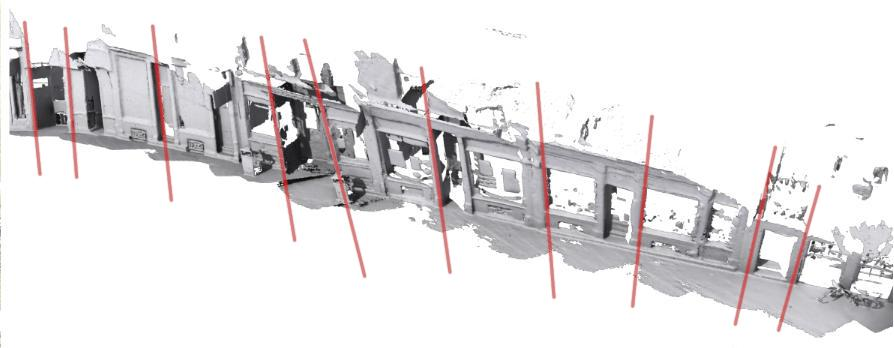
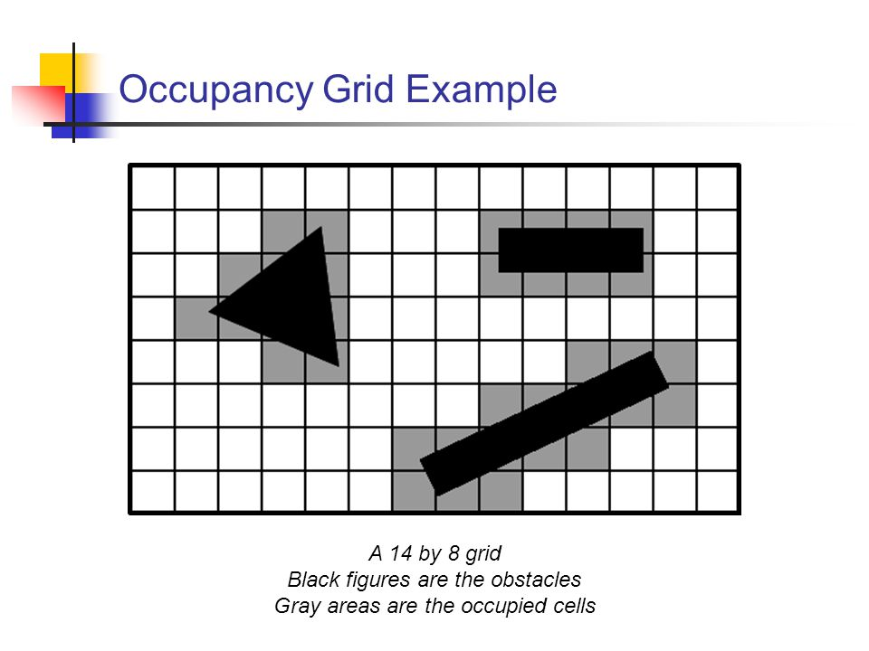
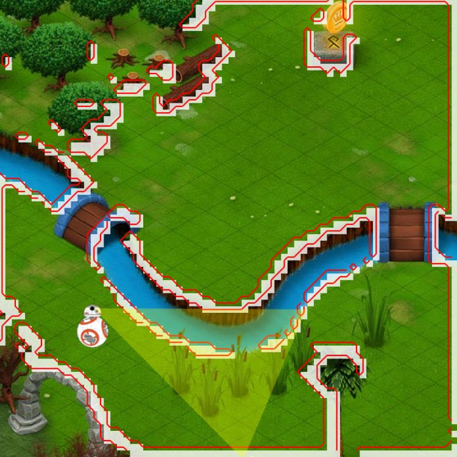
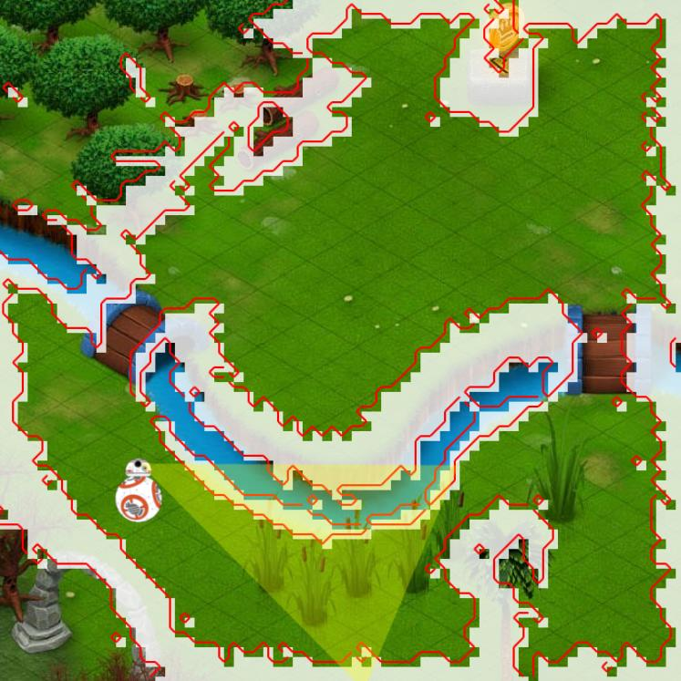
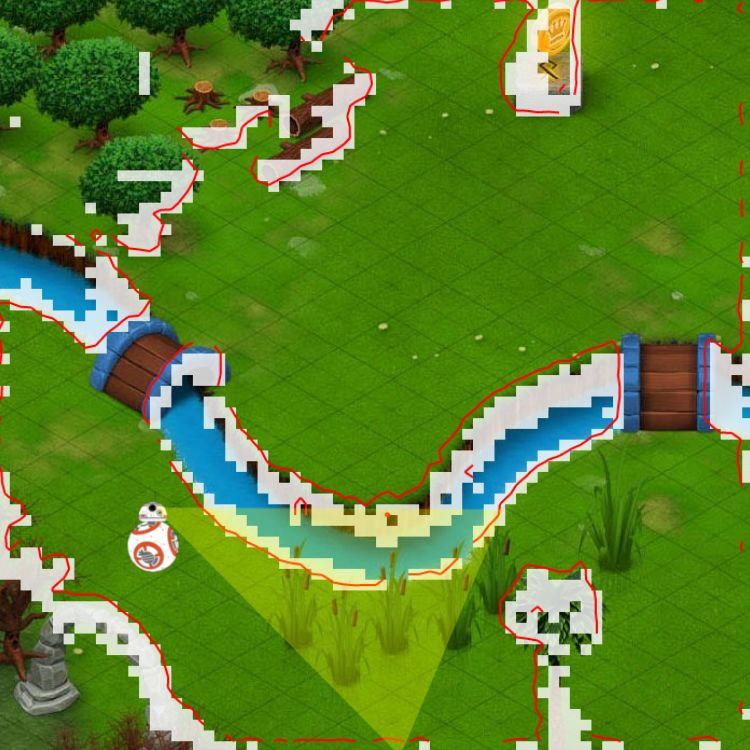
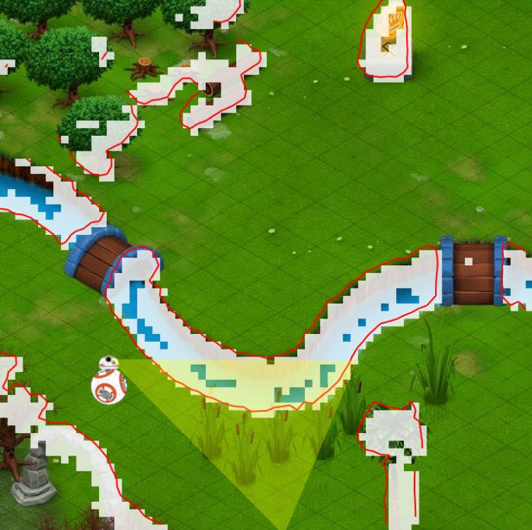
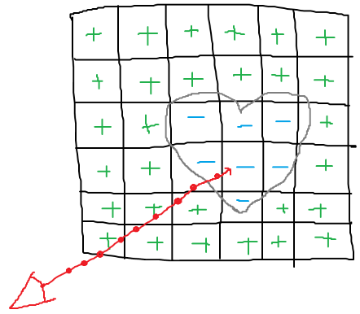

# Assignment 4: SLAM Part 1&mdash;Mapping

## Introduction
SLAM stands for **s**imultaneous **l**ocalization **a**nd **m**apping and describes a scenario in which a robot builts a map of an (unknown) environment that it is exploring while, at the same time, using said map to localize (/orient) itself. It is a very hard problem, not because it is comprised of **two** sub-problems/tasks, but because of their interaction: both the localizationd and the mapping task amplify each others' errors in a cyclic fashion.

Imagine a robot equipped with a depth sensor, such as the [Kinect](https://azure.microsoft.com/en-us/services/kinect-dk/) camera. Our robot records a [noisy depth map](https://graphics.stanford.edu/~mdfisher/Images/KinectSensors.png). Now it moves a few cm and records another noisy depth map. Let's assume that our robot is not equipped with any other sensors (GPS, wheel (turn) encoders, ...), meaning the only thing it has to go off of in order to localize itself is the map it built so far. How does it do that? By [registering](https://en.wikipedia.org/wiki/Iterative_closest_point) (/aligning) the current depth map with the previous one. Not only are both inputs noisy, the algorithm itself is imperfect (it does not guarantee to produce an error of 0 *even given perfect inputs*). Naturally, our new location estimate will be imprecise. This is the main challenge of SLAM: Noisy data leads to an inaccurate map which leads to an inaccurate pose estimate which in turn makes the map even worse. This effect, called drift, can be seen in the following scan obtained with [Kinect Fusion](https://www.youtube.com/watch?v=RR2fhy35oaY):



What is supposed to be a straight shop facade clearly bends along the reconstrution (/scanning) path.

In this assignment we want to focus on mapping alone, the pose will be provided for your. While mapping with a known pose is (almost) trivial, it is still an essential part of SLAM which you thus need to master. There are many mapping algorithms with different datastructures and trade-offs worth learning about. In later assignments we will combine both our localization and mapping knowledge into a complete SLAM algorithm.

## Mapping
SLAM is not a concrete algorithm, it's more of a meta-algorithm (/concept). You can substitute dozens of concrete algorithms for its two main components, *localization* and *mapping*. You've already learned two localization methods: (E)KF and particle filters. There are many more. Similarly, there are [dozens](http://robots.stanford.edu/papers/thrun.mapping-tr.pdf) of possible mapping algorithms. In this assignment we want to implement an algorithm known as ["depth map fusion"](https://www.microsoft.com/en-us/research/wp-content/uploads/2016/02/ismar2011.pdf). It belongs to the category of *dense, grid-based* algorithms and is in its nature **very** similar to [free space carving](https://www.cs.toronto.edu/~kyros/pubs/00.ijcv.carve.pdf) and [occupancy grids](https://ieeexplore.ieee.org/abstract/document/30720).

**Pros**:

- Produces very high-fidelity (3D) maps, suitable for the navigation of flying drones or for photo-realistic renderings
- [Embarassingly parallel](https://en.wikipedia.org/wiki/Embarrassingly_parallel)
- Simple to implement

**Cons**:

- Compute-and memory-intense (somewhat alleviated by recent advances in hardware, such as [Nvidia Jetson](https://developer.nvidia.com/buy-jetson))
- Requires additional post-processing to, for example, extract polygon meshes for rendering or graphs for path planning (i.e. using [marching cubes](https://en.wikipedia.org/wiki/Marching_cubes))

Simply put, depth map fusion (DMF), as any other grid-based algorithm, quantizes (/divides) the world into logical cells and then determines which cells are occupied (by obstacles typically) and which cells are free (to move through):



The cell size determines the map resolution. A self-driving car might require 10 cm, while a domestic robot might want to use a resolution of < 1 cm so it doesn't bump into things or knock things over. There's an inherent accuracy&hArr;memory consumption/speed tradeoff. In practice, DMF does a few more things in order to handle (depth) sensor noise and improve accuracy which we will learn about shortly.

## Preliminaries
The implementation of DMF (or any other grid-based mapping algorithm) requires strong knowledge of linear algebra, especially

- matrices and the role they play in transformations (translation, rotation, projection, conversion between coordinate systems and spaces)
- spaces such as "world space", "eye/camera space", "clip space", and normalized device coordinates (NDC)
- homogeneous coordinates
- left- vs right-handed coordinate systems (and how to convert between them)
- column- vs row-vectors and their impact on matrix multiplication order

This knowledge is also quintessential for robotics in general (for example calculating the kinematics of a robotic arm), computer vision, computer graphics, ... and is beyond the scope of this readme file. If the above terms are new to you please carefully read through/watch the following tutorials:

- [Journey of a Point: From World- to Screen Space](https://github.com/denniskb/hy475/wiki/Journey-of-a-Point:-From-World--to-Screen-Space)
- [Lecture 17 (assign. 4 tutorial)](https://www.csd.uoc.gr/~hy475/lectures/zoom_assign4.mp4)
- [OpenGL Matrices](http://www.opengl-tutorial.org/beginners-tutorials/tutorial-3-matrices/)
- [OpenGL - clip space, NDC, and screen space](https://www.youtube.com/watch?v=pThw0S8MR7w)

## Mapping without Noise
Head over to our [interactive robot simulator](https://denniskb.github.io/hy475/assign4). Our world is 700 x 700 px large. BB-8 is gonna roam through it on a pre-determined path. It is equipped with a (rotating/spinning) depth sensor similar to the Kinect, however in our example it will produce a 1D scanline rather than a 2D image. From the robot's scanning data combined with its location we want to construct a map of our environment that can later be used for path-finding, obstacle avoidance, etc. Our map will be represented by a grid with 70 x 70 cells, each cell spanning 10 x 10 px. We will start with a very simple implementation that more closely resembles occupancy grids and we will refine it over several steps until we arrive at a fully-fledged DMF implementation.

The first incarnation of our algorithm is described by the following pseudo-code:

1. **Create an empty 70 x 70 grid (/array)**. We could create a 2D-array but for our purposes it's gonna be easier to work with a 4900-element 1D array and manually compute a linear index from x and y coordinates using the formula `i = x + width * y` (width=70 in our case).
2. **Initalize the grid to `1`**. Per convention, occupancy grids use positive values for free space and negative values for obstacles. We will use `1` and `-1`. Since, at the beginning, we start with an empty map, our entire grid is initialized to a value of `1`.
3. **For each grid cell**:
    1. Compute the (2D) position of the cell *center* in *world space* (in px).
    2. Project it into *clip space* and *clip* (/cull) any grid cells outside our depth sensor's *viewing frustum*.
    3. Compute *normalized device coordinates* and then *screen coordinates*, use those to read the corresponding depth value from our sensor.
    4. Compare the observed with the physical depth. If they are within 7 px, store a `-1` in the corresponding array slot.

(This algorithm is roughly equivalent to the `occupancy_grid_mapping()` routine from your [lecture slides](https://www.csd.uoc.gr/~hy475/lectures/10.mapping-occupancy.ppt) (slide 10), albeit in more detail.)

Our depth sensor only observes ~100 samples at a time but there are 4900 grid cells. You may ask yourself "wouldn't it be more efficient to project our observed depth samples into world space and see which grid cells they intersect (/fall into), rather than projecting all grid cells into the sensor's eye (/camera) space?", and you'd be absolutely right. However, the full DMF requires that we update (almost) all grid cells per iteration so we might as well start with the correct architecutre.

The simulator should be pre-loaded with the following template:

```javascript
if (typeof this.grid === 'undefined') {
  this.grid = new Array(4900);

  for (var i = 0; i < 4900; i++)
    this.grid[i] = 1;
}
	
for (var y = 0; y < 70; y++) {
  for (var x = 0; x < 70; x++) {
    // Compute the 2D position of the grid cell center in world space (in px).
    // the '1' represents the homogeneous constant w=1
    var gridWorld = [..., ..., 1];
    // Project gridWorld into eye (/camera) space aka into the
    // sensor's viewing frustum.
    var gridEye = ...;
    // Project gridEye into clip space.
    var gridClip = ...;

    // Clip (/skip) any grid cells whose center is outside
    // the sensor's viewing frustum.
    // We only want to clip grid cells that are behind the sensor or
    // off to the left/right of its frustum. DO NOT clip any cells that
    // are in front of the sensor, even if they are "outside its range".
    if (...)
      continue;

    // Compute normalized device coordinates from gridClip by
    // doing the "homogeneous divide". We only care about the
    // x-coordinate at this point, you can discard the other
    // components of gridClip (y and w).
    var xNDC = ...;
    // Compute the screen coordinate of xNDC. The sensor resolution
    // is 'depth.length'.
    var xScreen = ...;

    // The observed depth is given by 'depth[xScreen]',
    // the physical depth is given by '-gridEye[1]'.
    // If both are within 7 px of each other, store a '-1'
    // in the corresponding array slot.
    if (...)
      this.grid[...] = -1;
  } // end for x
} // end for y
	
return this.grid;
```

The code is heavily commented with instructions that correspond 1:1 to the above pseudocode, albeit in more detail/more concretely. The grid is created and initialized for you, you have to fill in the gaps. You're also provided with 3 parameters:

- `depth` is a 100-element array representing the depth sensor's scanline. Each entry is a distance measurement in px *along the sensor's y-axis*.

- `worldToEye` is a 3x3 (affine) transformation matrix that converts coordinates from *world space* into *eye/camera space*.

- `eyeToClip` is a 3x3 projection matrix that converts coordinates from *eye space* into *clip space*.

If you fill in the gaps correctly (one short statement per **...** will suffice) you should observe the following end result:



The white squares represent occupied grid cells (with a negative value), empty grid cells are not rendered. The red line represents the exact boundary between empty and occupied space, more on that later.

## Mapping with Noise
That was easy, wasn't it? If we only lived in a perfect world without noise or drift... Check the "sensor noise" box and run your code again, you should observe something similar to the following:



Ouch!, that looks ugly! Two things happen when you turn on "noise": ~10% of the sensor's measurement are invalidated and don't return anything at all (the corresponding array slots contain `undefined`). The successful measurements suffer from (normally distributed) noise that *scales proportianlly with the distance*: For objetcs that are 50 px from the sensor your measurements may fluctuate by 1 or 2 px, for objects that are 400 px from the sensor they will fluctuate by up to 50 px.

### Empty Space Carving
The core observation of empty space carving and how it's able to handle even severe sensor noise, is that a depth measurement not only tells us something about our environment *at the point of the measurement* but also about everything *in front of the measurement*. Imagine your robot reports "obstacle 30 cm ahead". Not only do you know that there is an obstacle 30 cm ahead of you (disregarding sensor noise for now), you also know that **there are NO obstacles < 30 cm ahead of you**, or, in other words, that the entire space leading up to the obstacle is empty. After all, if it weren't, your robot would've reported 12 cm instead. How does this help with noise? If we've previously observed a region of space (a grid cell in our case) 10x as empty and our (noisy) sensor now reports an obstacle at this location, we can dismiss it as a noisy measurement with very high confidence (10 votes for empty vs 1 vote for occupied). Similarly, if we do store a `-1` in a grid cell because it is reported occupied by the sensor, but then observe the same cell as empty many times thereafter, we can confidently mark it as free after all.

To go from (na&#239;ve) occupancy grids to empty space carving requires two changes to our code:

1. Instead of storing a single number in our grid cells, we store 2-component vectors `[sum, weight]`. The first component is the *sum* of values (of `1`s and `-1`s) we've observed at this grid cell, the second component, the weight, represents the total number of values we've summed. The final value is equal to `sum/weight`. Example: You've observed a grid cell 9x as empty and 1x time as occupied, thus `sum = 9-1 = 8`, `weight = 10`, and `value = sum/weight = 8/10 = 0.8`, i.e. you're 90% certain that this cell is indeed empty (a value of 0 would mean that we are undecided, i.e. 50% (un)certain). Another example: You've observed a grid cell 3x as occupied and 2x as empty, thus `sum = 2-3 = -1`, `weight = 5`, and `value = -0.2`, i.e. you're only 60% certain that this cell is indeed occupied. In other words, whenever we observe a grid cell as empty, we increment its sum, whenever we observe it as occupied, we decrement its sum. In either case we increment the weight. This representation is known as a [moving/running average](https://en.wikipedia.org/wiki/Moving_average).
2. Not only do we want to update grid cells intersected by depth measurements, but also all cells in front of it according to the same rules as specified above.

Implement these changes now:

1. Instead of initalizing your grid with `1`, initialize it wit `[0,0]` (the first value doesn't matter since the weight is `0` to begin with anyway, meaning "we haven't observed this grid cell yet", i.e. "we have 0 confidence in its value".)
2. Instead of simply storing a `-1` in occupied cells, use the new update rules: Decrement the sum and increment the weight.
3. Add an `else if (...) { ... }` case after your last `if` case where you update *occupied* cells (the one you just modified). Inside the `else if` case you'll update *empty* cells instead by incrementing their sum and incrementing their weight, **but only cells in front of the measurement**.

If done correctly, and still with "sensor noise" turned on, you should observe the following:



In spite of noise we obtain a much crisper empty&hArr;occupied boundary, not as clean as the noise-free version, but much better than before. The map also contains some gaps. Normally you'd tweak some thresholds now to find a balance between a hole-free yet accurate map. One tweakable threshold is the radius in which we consider a measurement to intersect a cell (7 in our case). The second threshold is hidden inside the simulator's code: Only cells with a value < -0.2 are rendered as white squares (i.e. only cells for which we're at least 60% certain).

### DMF
DMF builds on top of empty space carving in order to further improve the accuracy of the obtained boundaries. One obvious way to increase accuracy is to increase our grid resolution, but it is very inefficient. In our case doubling the resolution quadruples the time and space requirements of the algorithm (in 3D it's even worse where your costs go up with the **cube** of the resolution). There's a more efficient way. So far, we've only been writing binary information (`1`s and `-1`s) to our grid. However, nothing stops us from writing continuous values based on the exact difference between the measured and the physical depth. Previously when encountering an occupied next to an empty cell we were forced to draw a boundary right down the middle, since that's all the information we had available. If on the other hand, the cells stored accurate (estimates of) distance values (form their centers to the actual boundary) we could draw the boundary anywhere between two neighborig cells' centers, based on their values, dramatically increasing our effective resolution.

Implement the following changes:

1. Compute the *continuous* signed distance `var sd = depth[xScreen] - -gridEye[1]` which will be negative for cells behind a measurment and positive for cells in front of a measurement, as it should be...
2. Update every grid cell that is *no more than 20 px behind* a depth measuremt with `min(20, sd)`.

If done correctly you should observe the following (with "sensor noise" stil turned on):



Notice how much smoother and more accurate our boundaries are, esp. along the river shore.

Please submit your (base64-encoded) final implementation of DMF to denniskb(at)csd.uoc.gr **by 11 May**.

## Omitted Details
**How is `depth` computed**?

Via [ray casting](https://en.wikipedia.org/wiki/Ray_casting):



*An object (a heart) is approximated via a [signed distance field](https://en.wikipedia.org/wiki/Signed_distance_function) (SDF): Positive values represent (empty) cells outside of all objects, negative values represent (occupied) cells inside objects/obstacles. (not depcited) The cells do not merely store the sign, but the exact distance from the cell center to the closest boundary. A ray is cast from the observer (the depth sensor in our case) through each pixel and the SDF is probed until a sign change is observed. The last two samples are linearly interpolated based on the stored values and the exact distance is reported.*

You can see the SDF that I'm using [here](https://github.com/denniskb/hy475/blob/master/docs/assign4/sdf.png) which I pre-computed in Matlab. The raycasting code is surprisingly simple and can be found [here](https://github.com/denniskb/hy475/blob/master/docs/assign4/index.html#L256). In practice you'd have to implement this yourself as you will use the raycasted depth to align it with the observed one, which will serve as an extra input into your EKF and improve your location estimation (in addition to using sensors, wheel encoders, etc.).

**How is the red boundary between occupied and free cells calculated?**

Via the [marching squares](https://en.wikipedia.org/wiki/Marching_squares) algorithm (or [marching cubes](https://en.wikipedia.org/wiki/Marching_cubes) in 3D). You can see its full implementation [here](https://github.com/denniskb/hy475/blob/master/docs/assign4/index.html#L198). In practice you'd use marching cubes to extract a polygon mesh from your map for visualization purposes.

**How are `worldToEye` and `eyeToClip` constructed?**

Simple transformation (rotation & translation) matrices are constructed by hand from the robot's parameters (location, orientation, ...). These are then multiplied together to form `worldToEye` and `eyeToClip` as can be seen [here](https://github.com/denniskb/hy475/blob/master/docs/assign4/index.html#L247) and [here](https://github.com/denniskb/hy475/blob/master/docs/assign4/index.html#L147). For the interested I also recommend reading [deriving OpenGL projection matrices](http://www.songho.ca/opengl/gl_projectionmatrix.html).

**Can we improve results further?**

A little bit. In practice we would define a sensor noise model and use it to weigh each measurement individually, rather than blindly incrementing `weight` (i.e. adding 1) for all, as we've been doing so far. Let's say our sensor reports 300 px and we compute a certainty of 20% for this measurement using our noise model. We would update our grid cell `[value, weight]` as `[(weight * value + 0.2 * 300) / (weight + 0.2), weight + 0.2]`.