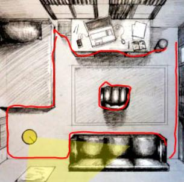

# Assignment 5: SLAM Part 2&mdash;FastSLAM


In this assignment we will combine your knowledge from [Assignment 3: Particle Filter](https://github.com/denniskb/hy475/tree/master/assign3_particle_filter) and [Assignment 4: Mapping](https://github.com/denniskb/hy475/tree/master/assign4_mapping) to implement grid-based FastSLAM using a particle filter. Recall that in assignment 4 we reconstructed a map from a known pose which was arguable *trivial*, even in the presence of sensor noise. There was no need to:

- Localize our robot
- Use our hitherto generated map to help with localization (it was simply an end product), and thus:
  - Raycast our map
  - Align depth maps

Now we want to **s**imultaneously **l**ocalize our robot **a**nd **m**ap our environemnt (using our reconstructed map as feedback for the localization procedure). This will re-introduce the well-known problem of *drift* which we will solve via particle filtering.

## Step 1: DMF

We start with last assignment's DMF implementation. Head over to our [interactive robot simulator](https://bautembach.de/hy475/assign5/) which is pre-loaded with the following template:

```javascript
if (typeof this.grid === 'undefined') {
  this.x = 50;
  this.y = 200;
  this.dir = 0;

  this.grid = new Array(1024);
  
  for (var i = 0; i < 1024; i++)
    this.grid[i] = [0, 0];
}

this.dir += deltaDir;
this.x += 2 * math.cos(this.dir);
this.y -= 2 * math.sin(this.dir);

var worldToEye = math.world2eye(this.x, this.y, this.dir);

math.dmf(this.grid, depth, worldToEye, eyeToClip);
  
return [[0, this.x, this.y, this.dir, this.grid]];
```

This represents a single particle. A particle consists of a weight (not stored for now), a belief about the state of the robot ((*x*, *y*) position and orientation *dir*), and a map of the environment *grid*. Upon the first invocation we initialize our robot to its known starting state and create an empty grid (as in assignment 4). In contrast to assignment 4, which provided us with the robot's pose (in form of the `worldToEye` matrix) we now need to estimate the robot's position and orientation ourselves, which we do via simple Euler integration. Once we've updated our robot's state we can calculate the `worldToEye` matrix which we need to perform one iteration of the DMF algorithm. `math.dmf()` literally expands to the code you just wrote in assignment 4 (albeit with a different grid size and truncation distance)&mdash;there is no need to re-write all that code here again (which would amont to mere copy-pasting anyway). Once done we return an array of particles. In this case our array only contains a single particle. Each particle is a 5-tuple `[weight, robotX, robotY, robotDir, grid]`, where the first 4 entries are numbers and grid is itself a 1024-element array representing a 32x32 TSDF.

If you run this code with 'Tyre slip' turned off you should see the following:


A familiar sight. Next turn 'Tyre slip' on and run the simulator again:


What happened? While the robot relays its control inputs to us via the `deltaDir` parameter it executes these commands imperfectly resulting in 'drift': We believe to be in a different location than we actually are and this error accumulates over time. In the above image this belief is represented via the green 'ghost robot'. For now it's a single one since we're working with a single particle. In general, all your particles will be visualized as ghost bots in the top image of the simulator (each with a different transparent color so you can distinguish them). The yellow robot (with its yellow cone) represents the ground truth.

## Step 2: Multiple Particles

Generalize this code from 1 to `N` particles. Set `N=5` for now. Still with 'Tyre slip' turned on, re-run the simulation. If done correctly you should observe the following:


The simulator always displays your 5 best particles' maps (determined by their weight, highest&rarr;lowest)  regardless of how many particles you create. The best particle's map is shown in large at the top followed by smaller renditions of the next-best 4 maps. In addition the simulator renders a ghost robot for *every* particle (no matter how many there are) in the top image. The reason we see 5 maps but only 2 bots is because, while we created 5 particles, they are all identical: The are initialized and updated exactly the same. Thus they all clump together in the same location and produce the exact same map.

## Step 3: Randomization

Add some randomization to your particles' update steps in order to diversify them. For this you'll need to know that the robot executes turn inputs with an accuracy of `0.07 * abs(deltaDir)` STDs. You can use the `math.random()` function for uniformly distributed numbers or the `math.normrnd(mu, std)` for normally distributed random numbers. If done correctly, you should observe the following (still with 'Tyre slip' turned on):


The particles are no longer clumped together (as seen by the overlapping ghost bots in the top image) since every particle follows/explores a slightly different path. As you can see this also results in different maps being reconstructed per particle now.

Carefully study each individual map. Notice how they all got strenghts and weaknesses. For example, the 3rd map from the left (bottom row) very closely resembles the bottom left corner of the room, but it cuts into the couch. The couch looks nice in the 4th map from the right (bottom row) but the space between the bed and desk isn't as crisp as in the 1st map (bottom)...

This is the key observation that will allow us to eliminate drift via particle filtering: Each particle *temporarily* (/locally) produces very accurate maps. By *evaluating* the quality of these maps on the fly and *resampling* our particles accordingly, we can 'combine the good parts' into one coherent, accurate overall map.

## Step 4: Weight Calculation

Before we can re-sample our particles we need to calculate appropriate weights. We will do so by ray-casting our own maps and comparing the obtained depth map with the observed one. The more similar they are, the more accurate is our map, and the higher our weight should be. It is important that we perform this step after the location update but before the DMF step, as integrating the current depth map into our grid first might falsify our results. I.e.:

1. The real robot moves in a certain way
2. We predict its movement (imperfectly)
3. We then raycast *our* grid from *our* believed location and compare the obtained depth map with the observed one (from the sensor). The more similar they are, the better our prediction step had worked. We compute our particle's weight.
4. Only then do we integrate the observed depth into our grid via DMF.

In order to ray-cast your grids you can use the `math.raycast(grid, x, y, clipToWorld)` function. It produces a 50-px depth map just like `depth`. It requires a `clipToWorld` matrix which you can calculate using your `worldToEye` and `eyeToClip` matrices and the [math.js](https://mathjs.org/docs/reference/functions.html) library.

In order to calculate the weight you will need to calculate the error between 2 depth maps. A simple metric such as 'mean absolute error' or 'mean squared error' will do. Use the functions provided by math.js to avoid writing loops. Don't forget to update your particle's weight.

## Step 5: Re-sampling

Go ahead and implement the rest of the particle filter: weight normalization, bucket computation, low-variance re-sampling. You'll be able to copy-paste 99% of your code from assignment 3 (the solutions for both assignment 3 & 4 have been re-opened (GitHub issues) to assist you). One thing changes compared to the particle filter from assignment 3 though: You have to use the free function `clone()` rather than the method `Array.clone()`. In assignment 3 you did:

```javascript
var arr = [1, 2, 3];
var copy = arr.clone();
```

In this assignment you'll do:

```javascript
var arr = [1, 2, 3];
var copy = clone(arr);
```

(`clone()` can be used to create deep copies of any object (but you'll only require it for cloning your particles during the re-sampling step)).

The algorithm is very sensitive to the randomization noise and weight calculation. Tune both until you obtain decent reconstructions. Here's mine with just 5 particles (and 'Tyre slip' turned on):



(Notice how nicely all 5 particles converged to almost the true location.)