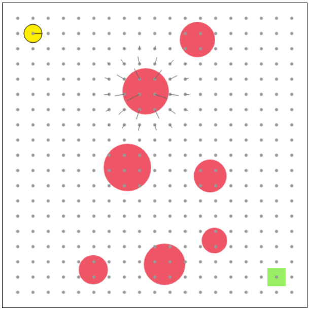

# Assignment 6: Path Planning & Obstacle Avoidance


(This assignment is divided into two parts: In part 1 you simply have to compute the path from the robot to its target (as seen in the picture above). Correct solutions get awarded 20 points. Part 2 is *optional*. In it you have to actually navigate to the target by feeding the robot control inputs, *all the while localizing the robot, computing the map on the fly using [Lidar](https://en.wikipedia.org/wiki/Lidar), and avoiding obstacles as they pop up*. Up to **20 bonus points** will be waiting for the courageous among you.)

In this final assignment we want to compute (and subsequently navigate through) travel paths for our robot given its location, the location of a target it'd like to reach, and a map filled with obstacles it ought to navigate around. As with all aspects of robotic navigation, once again there are [dozens](https://en.wikipedia.org/wiki/Motion_planning) of algorithms that fit the bill, most notably [BFS, Dijsktra, and A*](https://www.redblobgames.com/pathfinding/a-star/introduction.html) which are obvious choices for grid-based maps as we've dealt with before. We will implement another, very interesting algorithm: [artificial potential fields](https://en.wikipedia.org/wiki/Motion_planning#Artificial_potential_fields) (aka artificial/virtual force fields). The idea behind them is that the target attracts the robot, while obstacles repel it (think of masses bending space-time or charged particles creating a magnetic field). They're called artificial because they don't actually exist--they are but a mental (/programmatic) model. Potential fields have several advantages:

1. They can be computed completely locally. At no point do we require a global/total map of our environment. A partial (not particularly precise) map in the vicinity of our robot completley suffices. Thus, loop closure is a non-issue. Strictly speaking we needn't even know the absolute locations of our robot/target as long as we know which general direction to travel in (for example using a compass).
2. (1) makes potential fields incredibly cheap computationally. Neither the field nor the path need to be known in whole at any given moment. We only ever care about the next step, meaning it suffices to evaluate potential fields at our current location.
3. They create naturally smooth paths which allows for efficient robot navigation (rather than having to stop, turn, accelerate, ...).
4. They are very easy to implement.

They come with some dis-advantages as well:

1. They can get stuck in local optima.
2. Even if they do not get stuck, the paths they produce are far from the shortest possible.

## Part 1: Path Planning
Potential fields are very easy to understand: The target exerts a *map-wide* force attracting our robot. Each obstacle exerts a *local* force repelling our robot so it doesn't crash. The force is local because we don't want an obstacle a kilometer away influencing our path. This area of influence around an obstacle is known as the obstacle's "spread" *s*. The final force at any point in the field is then simply the sum of all these individual forces, and is equal to the direction the robot should move in.

Below we see the force field only due to the target. It acts on the entire map:


Next we see the field only due to the 2nd obstacle from the top, first unlimited:


Then with its spread set to *s*=50 px, notice how the field smoothly drops of as it gets to the edge of the spread:



Finally, the combined force of the target and the 2nd obstacle is simply their sum:


And for completeness here's the field taking into account all obstacles:


Head over to our [interactive robot simulator](http://denniskb.github.io/hy475/assign6/) which is pre-loaded with the following template:

```javascript
// Function that computes the force field at position 'pos' = [x, y]
// given list of obstacles 'obs' = [[[x, y], r], ...].
function ff(pos, obs) {
  // TODO: Implement
  return math.normalize([1, 1]);
}
math.drawForceField(ff);

// Function that computes the path from the robot
// to the target using 'ff'.
function plan(obs) {
  // TODO: Implement
  return [[50, 50], dst];
}
math.drawPath(plan);

return [0, 0];
```

which produces the following output:


The field blindly points in a single direction and our path is a straight line disregarding all obstacles. Your job is to implement functions `ff()` and `plan()` in order to produce the image at the beginning of this readme.

- `ff(pos, obs)` is a function that accepts a 2D position `pos = [x, y]`, a list of obstacles `obs`, and from these calculates the *direction* of the force field *at location* `pos`. `obs` has the format `[[[x, y], r], ...]` where each obstacle is a position-radius pair.
- Obstacles only consist of a position and a radius. *You* have to compute an appropriate spread *s* per obstacle. This could be a simple constant margin on top of the radius or something more involved. The repelling force should smoothly drop off from 1 at the obstacle's boundary to 0 at the edge of its spread.
- `dst` is the 2D location `[x, y]` of the green target.
- `ff()` is supposed to return a direction, i.e. a 2D vector with length 1.
- The functions [`math.norm()`](https://mathjs.org/docs/reference/functions/norm.html), [`math.distance()`](https://mathjs.org/docs/reference/functions/distance.html), and `math.normalize(v) := v / |v|` may prove helpful.
- Once done you can check that `ff()` works correctly by passing it into the `math.drawForceField()` function which evaluates your function at 400 evenly spaced locations and visualizes it as little flags (wind direction == field direction).
- Implement `ff()` in stages, checking periodically whether you're on the right track. First, only consider the target and nothing else. Next consider a single obstacle without spread, for example `obs[0]`. Then add a spread to it. Then combine its with the target's field. Finally combine the fields from all obstacles.
- `plan(obs)` is a function that computes the path from the robot's location `[50, 50]` to the target using the same list of obstacles as `ff()`.
- It's supposed to produce a list of 2D coordinates `[[x, y], ...]`.
- Once you implement `ff()` correctly, its implementation should be trivial. The `Array.back()` method which returns an array's last element (without removing it) may be helpful. You can visualize your path by passing it to the `math.drawPath()` function.

Submit your code to denniskb(at)csd.uoc.gr by **4 June**.

### Additional Reading
- [Motion Planning with Potential Fields](https://www.youtube.com/watch?v=3PYWezYama0) Nice, short overview (youtube).
- [potential fields explanation](https://www.youtube.com/watch?v=omqTgNCXfbQ) Great, in-depth explanation of the math behind potential fields *and how it translates into code* (youtube). (The presented code is very cumbersome--you should only need a handful of lines to implement both functions. However, the tutorial still does a great job at clarifying and concretizing the high-level concepts.)

## Part 2: Obstacle Avoidance
Comment out your `math.draw...()` function calls. You may have noticed that the overall function you're implementing (`control()`) returns a 2-component vector `[0, 0]`. This is a control input for the robot. The first value instructs it to turn (positive = counter-clockwise, negative = clockwise), the 2nd value instructs it to drive (positive = forwards, negative = backwards). The robot can drive and turn at the same time. The magnitude of the values does not matter, only their sign. Play around with both values to get a feeling for your robot's controls, maybe even make it crash into a wall or obstacle ;)

Next check the 'Show Lidar' box. You should see the following:


The robot sends out laser rays in a 90&deg; cone with a resolution of 0.05 rad and reports their intersection points in the `pcl = [[x, y], ...]` parameter. In contrast to assignments 4 & 5 which provided you with 1D depth measurements, Lidar provides you with 2D coordinates already in world space. Notice that the function `control()` does not have a parameter `obs`. That parameter was provided to you by the `math.draw...()` functions solely to test your `ff()` and `plan()` implementations. For Part 2 however, you will have to *estimate* the locations, radius, and spread of obstacles yourself using the measurements in `pcl`.

Knowing that...

- The robot starts at location (50, 50) facing in direction 0.

- Control inputs `u = [turn, drive]` are translated into motion using the following rules:

```javascript
dir += Math.sign(u[0]) * Math.PI/120;
x += Math.sign(u[1]) * Math.cos(dir);
y -= Math.sign(u[1]) * Math.sin(dir);
```

- There is **no** trye slip or sensor noise.

...navigate the robot programmatically from its starting location to the green target (without crashing :P).

Submit your code by **4 June**.